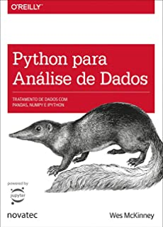

## Bem-vindo(a)!
               
        
  
 
 Tudo junto trabalhando para que os dados gerem valor para seu negócio.    
### <i> Ciência de Dados, Aprendizagem de máquina e Business analytics</i>:

São ferramentas que descrevem a exploração dos dados de uma organização, com ênfase na análise estatística. Envolve a utilização de tecnologias e métodos avançados de análise de informações das mais variadas fontes e volumes de dados. 
Modelos de Machine learning, para trabalhar áreas de negócios como: Análise de crédito e cobrança, Marketing, Clientes, Fornecedores, Financeiro, Auditoria, etc.  Em temas que precisarmos prever determinadas situações, suportar a decisão estratégica dos negócios.

### Dicas livros:

<!---

https://www.mjvinnovation.com/pt-br/blog/business-analytics-para-negocio/   ## site

<i> Biodiversity in National Parks</i> is an app that let you visualize [Kaggle's biodiversity dataset](https://www.kaggle.com/nationalparkservice/park-biodiversity).

From the left navigation panel you'll be able to access the maps, data and charts concerning the US National Parks and their resident species.

It has been made with [shiny](https://shiny.rstudio.com/) and you may find the code on [github](https://github.com/abenedetti/bioNPS/) and [rcloud](https://rstudio.cloud/project/246130). 

For a quick walkthrough have a look a the video below.
   
<iframe style = "display: block; margin: auto;" width="640" height="360" src="https://www.youtube.com/embed/Qu2J2ytWqxA?hd=1"></iframe>

-->